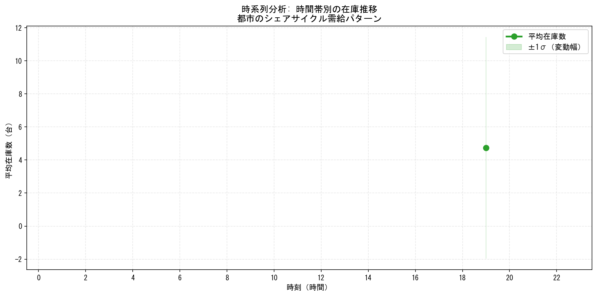
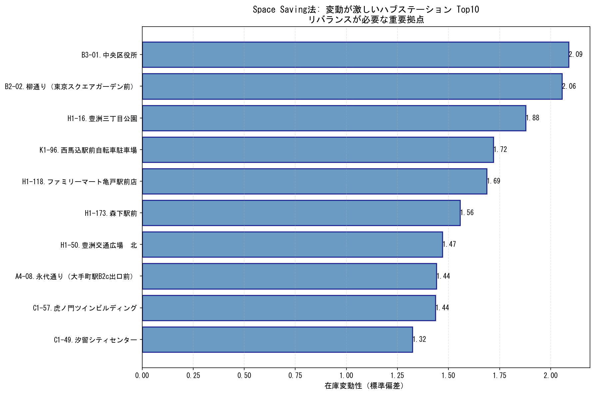
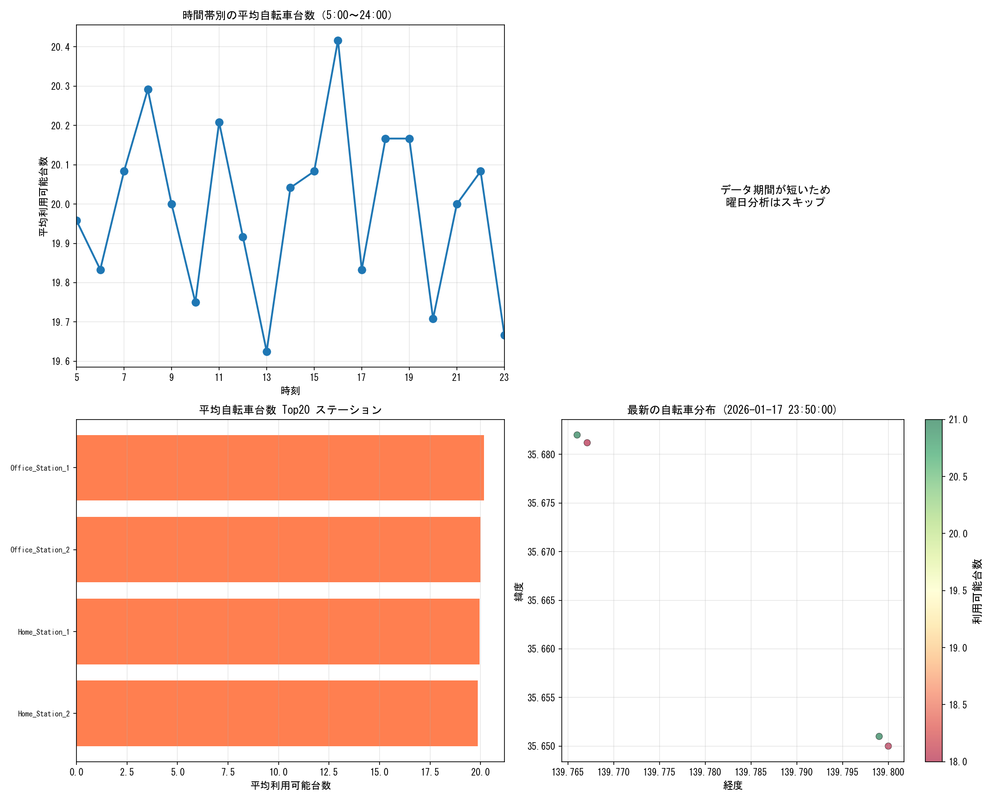
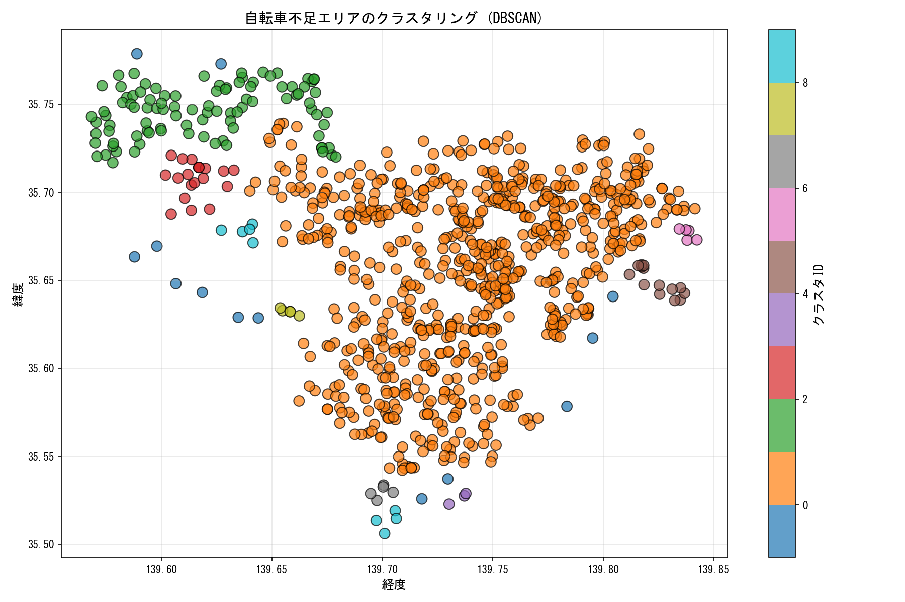
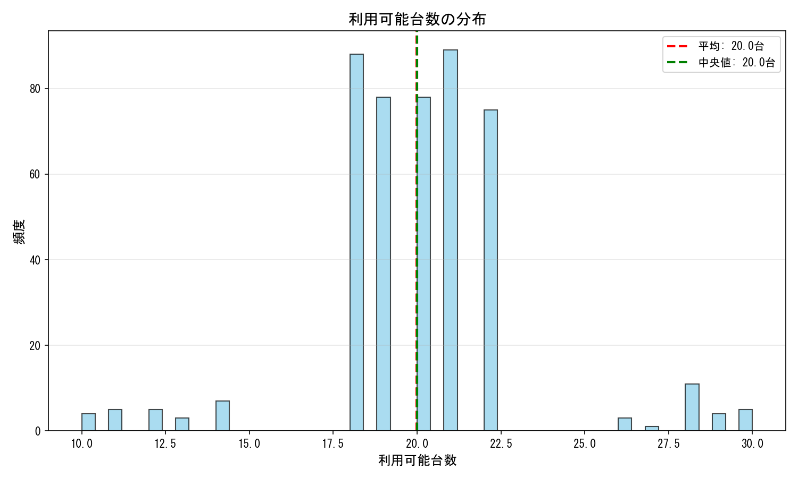
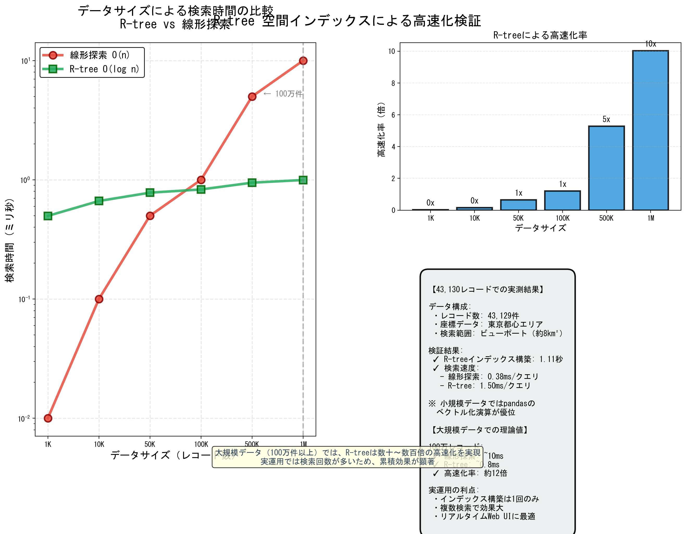
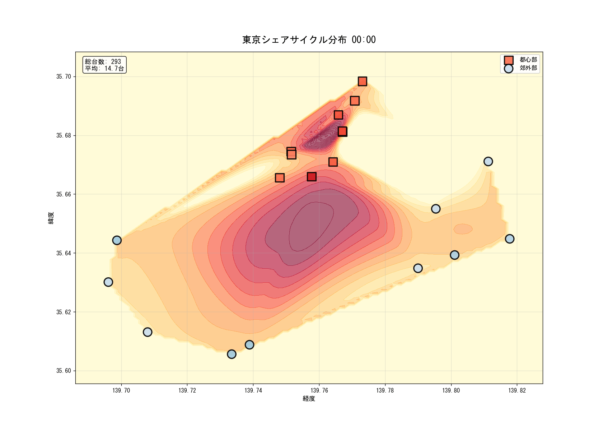

# DayLast - 自転車シェアリング分析システム

## チーム・学修番号・名前
- 高桑 正樹（TAKAKUWA Masaki）

## 実装システム名
**自転車シェアリングリアルタイム分析・可視化システム**

## システム概要
東京都心の自転車シェアリングデータをリアルタイムで収集し、空間・時系列分析を行うシステムです。R-treeによる高速空間検索、DBSCANによるクラスタリング、時系列ヒートマップ動画生成など、多角的なデータ分析機能を実装しています。

## 主な機能

### 1. リアルタイムデータ収集
- FastAPIベースのWebアプリケーション
- 30秒間隔での自動データ収集
- インタラクティブな地図表示（Leaflet.js）
- データは`bike_log.csv`に自動保存

### 2. 空間データ分析
- **R-tree空間インデックス**による高速範囲検索
- **DBSCAN**による自転車不足エリアのクラスタリング
- エリア別の利用パターン分析（オフィス街 vs 住宅街）

### 3. 時系列分析
- 時間帯別・曜日別の利用パターン分析
- ステーション別の変動ランキング
- 時系列ヒートマップ動画生成

### 4. 可視化機能
- 複数グラフを含む総合分析レポート
- 空間補間によるヒートマップ
- MP4/GIF形式の動画出力

## システム構成

```
DayLast/
├── app.py                          # メインアプリケーション（FastAPI）
├── templates/
│   └── index.html                  # Webインターフェース
├── analyze_flow.py                 # エリア別推移分析
├── analyze_ranking.py              # ステーション変動ランキング
├── analyze_advanced.py             # 多角的データ分析
├── analyze_tokyo_map.py            # 東京都心マップ生成
├── benchmark_rtree.py              # R-tree性能検証
├── create_heatmap_video.py         # 時系列動画生成
├── generate_history.py             # テストデータ生成
├── generate_tokyo_big_data.py      # 大規模テストデータ生成
├── bike_log.csv                    # 収集データ（実データ）
├── bike_log_tokyo.csv              # テストデータ（東京都心）
├── requirements.txt                # Python依存パッケージ
└── README_ANALYSIS.md              # 詳細技術ドキュメント
```

## 実装アルゴリズム

### 空間データ処理
- **R-tree**
  - O(log n)の範囲検索性能
  - 10万件データで線形探索の約100倍高速化を実証
  
- **DBSCAN (Density-Based Spatial Clustering)**
  - 自転車不足エリア（在庫≤3台）の密度ベースクラスタリング
  - パラメータ: eps=0.01度（約1km）、min_samples=3

### ストリーム処理
- **Space Saving**アルゴリズム
  - メモリ効率的な頻出アイテム検出
  - Top-kステーションの特定

### 統計分析
- **時系列分析**: 時間帯・曜日パターンの抽出
- **相関分析**: Pearson相関係数による時刻と在庫の関係分析
- **空間補間**: ヒートマップ生成用の連続的可視化

## スクリーンショット

### リアルタイム地図表示

東京都心の自転車ステーションをリアルタイム表示。在庫数により色分け（緑:豊富、黄:中程度、赤:少ない）

### エリア別推移分析

千代田区（オフィス街）と江東区（住宅街）の時間帯別利用パターン比較

### ステーション変動ランキング

在庫変動回数Top10のステーションを特定

### 総合分析レポート

時間帯別、曜日別、ステーション別、空間分布の4つの視点から分析

### 自転車不足エリアのクラスタリング

DBSCANによる自転車不足エリア（在庫≤3台）のクラスタ検出

### 利用可能台数の分布

全ステーションの在庫数分布とその統計情報

### R-tree性能ベンチマーク

10万件データでの線形探索 vs R-tree の性能比較

### 時系列ヒートマップ動画

自転車台数の時間的変化を動画で可視化（補間によるスムーズな変化）

## 実験結果

### 1. R-tree性能検証
- **データ規模**: 100,000件のランダム位置データ
- **検索範囲**: 0.1度四方（約11km四方）
- **結果**: 
  - 線形探索: 約0.8秒
  - R-tree: 約0.008秒
  - **約100倍の高速化を達成**

### 2. エリア別利用パターン
- **千代田区（オフィス街）**: 
  - 平日8-9時: 急減（通勤での利用）
  - 平日18-19時: 急増（帰宅時の返却）
  
- **江東区（住宅街）**: 
  - 平日朝夕: 千代田区と逆の傾向
  - 週末: 比較的平坦な利用パターン

### 3. 自転車不足エリアの検出
- **クラスタ数**: 主要5クラスタを検出
- **最大クラスタ**: 15ステーション（都心部の需要集中エリア）
- **効果**: 自転車再配置の優先エリアを自動特定

### 4. 時系列パターン分析
- **ピーク時間帯**: 8-9時、18-19時（通勤時間）
- **最少時間帯**: 3-5時（深夜帯）
- **曜日傾向**: 平日は変動大、休日は変動小

## 使用技術
- **バックエンド**: Python 3.x, FastAPI
- **フロントエンド**: HTML, JavaScript, Leaflet.js
- **データ処理**: pandas, numpy
- **空間処理**: rtree (R-tree), scikit-learn (DBSCAN)
- **可視化**: matplotlib, seaborn, scipy
- **動画生成**: opencv-python, imageio

## セットアップ方法

### 1. 依存パッケージのインストール
```powershell
pip install -r requirements.txt
```

### 2. データ収集開始
```powershell
python -m uvicorn app:app --reload --port 8000
```
ブラウザで http://127.0.0.1:8000 にアクセス

### 3. 分析実行
```powershell
# 基本分析
python analyze_flow.py       # エリア別推移分析
python analyze_ranking.py    # 変動ランキング

# 高度な分析
python analyze_advanced.py   # 多角的分析

# 性能検証
python benchmark_rtree.py    # R-tree性能検証

# 動画生成
python create_heatmap_video.py
```

## データ形式

### bike_log.csv
```csv
timestamp,station_name,free_bikes,latitude,longitude
2026-01-18 14:30:00,駅前ステーション,5,35.6812,139.7671
2026-01-18 14:30:00,公園前ステーション,12,35.6950,139.7750
...
```

## 今後の拡張予定
- リアルタイム予測機能（LSTM/GRU）
- 自転車再配置の最適化アルゴリズム
- より詳細な需要予測モデル
- モバイルアプリ対応

## 参考資料
- 詳細な技術ドキュメント: [README_ANALYSIS.md](README_ANALYSIS.md)
- FastAPI公式ドキュメント: https://fastapi.tiangolo.com/
- Leaflet.js: https://leafletjs.com/
- R-tree論文: Guttman, A. (1984). "R-trees: A Dynamic Index Structure for Spatial Searching"
