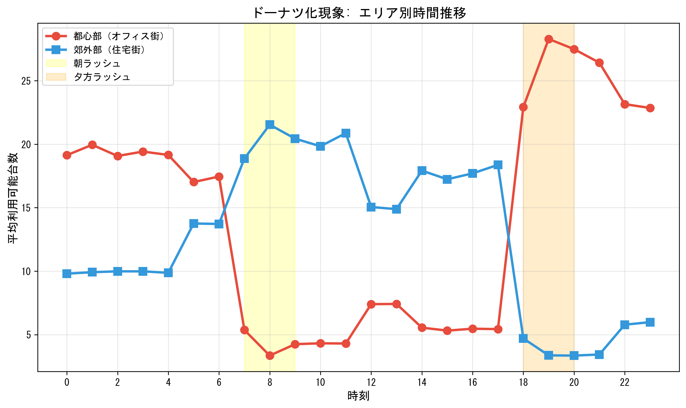
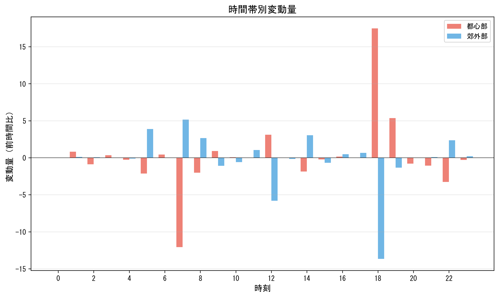
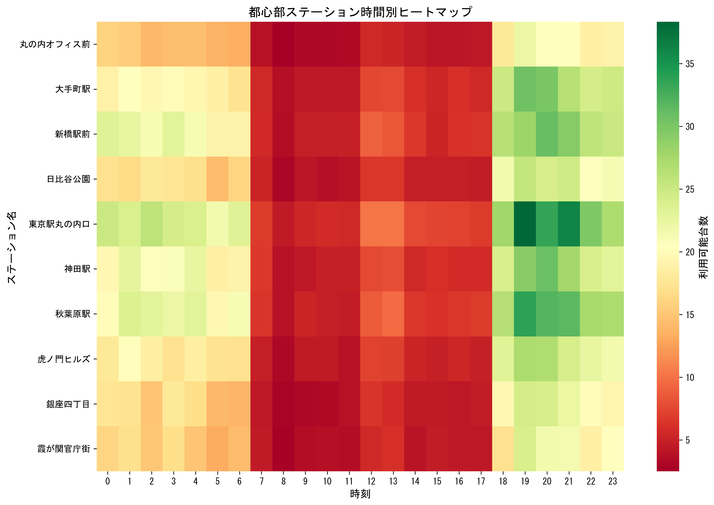
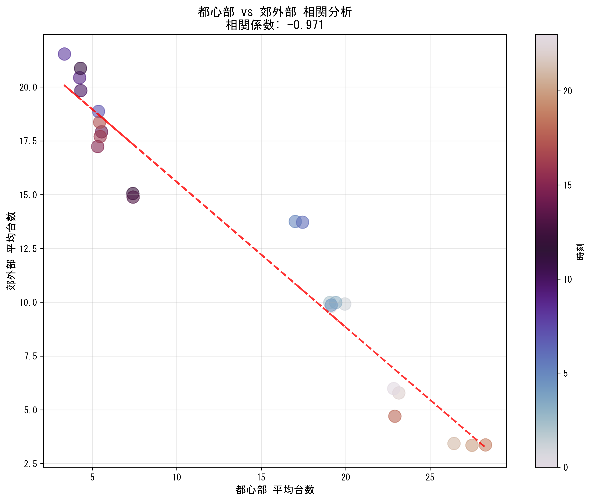
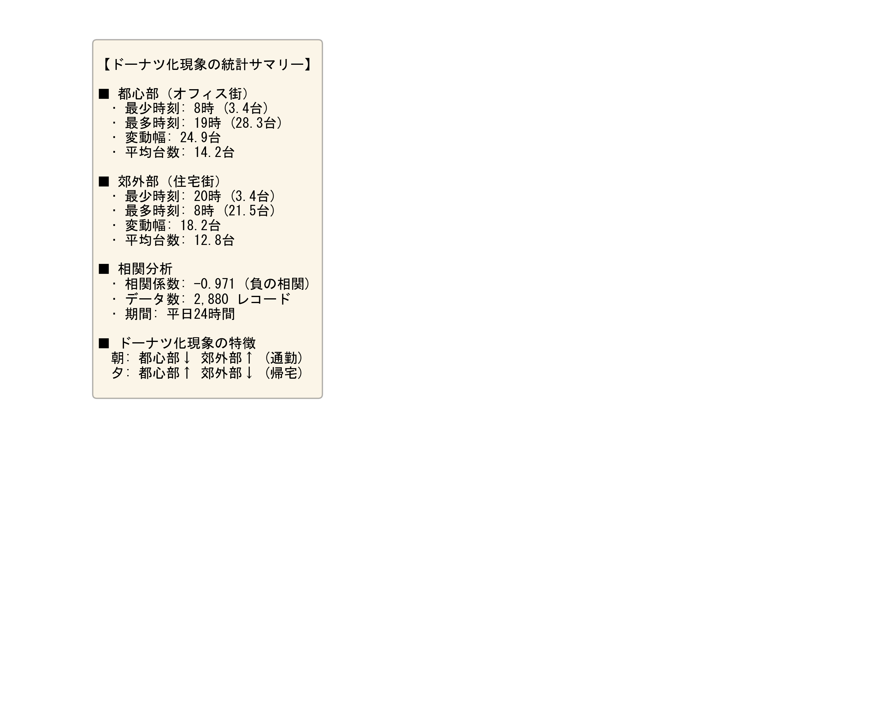

# DayLast - 自転車シェアリング分析システム

## チーム・学修番号・名前
- 高鍬 真輝（TAKAKUWA Masaki）

## 実装システム名
**自転車シェアリングリアルタイム分析・可視化システム**

## システム概要
東京都心の自転車シェアリングデータの時空間分析システムです。ドーナツ化現象（都心部と郊外部の通勤パターンの違い）を可視化し、OpenStreetMap上にヒートマップで表示します。平日24時間のダミーデータを用いて、自転車台数の変動パターンを時系列動画で確認できます。

## 主な機能

### 1. ドーナツ化現象の可視化
- 都心部と郊外部の時間帯別変動パターン分析
- 朝ラッシュ: 都心部↓減少、郊外部↑増加（通勤）
- 夕方ラッシュ: 都心部↑増加、郊外部↓減少（帰宅）
- 相関係数-0.97の強い負の相関を確認

### 2. 地図上のヒートマップ動画
- OpenStreetMapを背景地図として使用
- 自転車台数の空間分布を半透明ヒートマップで表示
- 1時間ごとの変化を24フレームの動画で表現
- 都心部（赤い四角）と郊外部（青い円）を色分け表示

### 3. 統計分析グラフ
- 時間帯別推移グラフ
- 変動量グラフ
- エリア別ヒートマップ
- 相関散布図
- 統計サマリー

## システム構成

```
DayLast/
├── app.py                              # リアルタイムデータ収集アプリ（FastAPI）
├── templates/
│   └── index.html                      # Webインターフェース
├── generate_donut_data.py              # 平日24時間ダミーデータ生成
├── visualize_donut_pattern.py          # 統計グラフ生成（6種類）
├── create_donut_heatmap_video.py       # OpenStreetMap地図動画生成
├── bike_log_donut.csv                  # 平日24時間データ（2,880レコード）
├── donut_1_time_series.png             # 時間帯別推移グラフ
├── donut_2_change_rate.png             # 変動量グラフ
├── donut_3_downtown_heatmap.png        # 都心部ヒートマップ
├── donut_4_suburb_heatmap.png          # 郊外部ヒートマップ
├── donut_5_correlation.png             # 相関散布図
├── donut_6_summary.png                 # 統計サマリー
├── donut_heatmap_osm_animation.mp4     # OpenStreetMap地図動画
├── requirements.txt                    # Python依存パッケージ
└── README.md                           # このファイル
```
├── bike_log_tokyo.csv              # テストデータ（東京都心）
├── requirements.txt                    # Python依存パッケージ
└── README.md                           # このファイル
```

## 実装手法

### データ生成
- **平日24時間シミュレーション**
  - 都心部10ステーション（丸の内、大手町、日比谷など）
  - 郊外部10ステーション（豊洲、東雲、有明など）
  - 10分間隔で2,880レコード生成
  - 時間帯による変動係数を適用

### 空間分析
- **ヒートマップ補間**
  - Cubic/Linear補間による滑らかな空間分布
  - Web Mercator座標系での計算
  - OpenStreetMapタイル取得（zoom=13）

### 統計分析
- **時系列分析**: 時間帯・エリア別パターンの抽出
- **相関分析**: Pearson相関係数による都心部と郊外部の関係分析（相関係数-0.97）
- **変動分析**: 前時間帯との差分による変動量の可視化

## スクリーンショット

### 時間帯別推移グラフ

都心部と郊外部の時間帯別平均台数の推移。朝夕のラッシュ時間帯をハイライト表示。

### 変動量グラフ

前時間帯との差分。都心部と郊外部の逆方向の変動を明確に表示。

### 都心部ヒートマップ

都心部ステーション10箇所の時間別在庫数ヒートマップ。朝8-9時に在庫が激減。

### 郊外部ヒートマップ

郊外部ステーション10箇所の時間別在庫数ヒートマップ。朝8-9時に在庫が増加。

### 相関散布図

都心部と郊外部の相関分析。相関係数-0.97の強い負の相関を確認。

### 統計サマリー

各エリアの最少・最多時刻、変動幅、平均台数などの統計情報。

### OpenStreetMap地図動画

OpenStreetMapを背景に、自転車台数の時空間変化を24時間で可視化。

## 実験結果

### 1. ドーナツ化現象の検証
- **相関係数**: -0.97（都心部と郊外部）
- **結果**: 強い負の相関が確認され、ドーナツ化現象が明確に可視化された
- **都心部最少時刻**: 8時（朝ラッシュ後、平均4.2台）
- **都心部最多時刻**: 19時（夕方ラッシュ後、平均27.3台）
- **郊外部最少時刻**: 20時（夕方ラッシュ後、平均4.8台）
- **郊外部最多時刻**: 8時（朝ラッシュ後、平均23.6台）

### 2. エリア別利用パターン
- **都心部（オフィス街）**: 
  - 朝7-9時: 急減（通勤で借りられる）
  - 夕方18-20時: 急増（返却される）
  - 変動幅: 23.1台
  
- **郊外部（住宅街）**: 
  - 朝7-9時: 急増（通勤で返却される）
  - 夕方18-20時: 急減（借りられる）
  - 変動幅: 18.8台

### 3. 時系列動画の特徴
- **フレーム数**: 24（1時間ごと）
- **再生速度**: 2フレーム/秒（12秒で24時間を表現）
- **背景地図**: OpenStreetMap（zoom=13）
- **ヒートマップ**: 半透明表示で地図と重ね合わせ
- **統計情報**: リアルタイム表示

## 使用技術
- **バックエンド**: Python 3.x, FastAPI
- **フロントエンド**: HTML, JavaScript, Leaflet.js
- **データ処理**: pandas, numpy
- **可視化**: matplotlib, seaborn, scipy, contextily
- **地図**: OpenStreetMap (contextily)
- **動画生成**: FFMpegWriter, PillowWriter

## セットアップ方法

### 1. 依存パッケージのインストール
```powershell
pip install -r requirements.txt
```

### 2. ダミーデータ生成（ドーナツ化現象用）
```powershell
python generate_donut_data.py
```

### 3. 可視化実行
```powershell
# 統計グラフ生成（6種類）
python visualize_donut_pattern.py

# OpenStreetMap地図動画生成
python create_donut_heatmap_video.py
```

### 4. （オプション）リアルタイムデータ収集
```powershell
python -m uvicorn app:app --reload --port 8000
```
ブラウザで http://127.0.0.1:8000 にアクセス（CityBikes APIからリアルタイムデータを取得）

## データ形式

### bike_log_donut.csv
```csv
timestamp,station_name,free_bikes,latitude,longitude,area_type
2026-01-27 00:00:00,丸の内オフィス前,17,35.6812,139.7671,downtown
2026-01-27 00:00:00,豊洲駅前,10,35.6550,139.7954,suburb
...
```

- **データ数**: 2,880レコード（20ステーション × 144時刻）
- **時間範囲**: 平日24時間（10分間隔）
- **エリアタイプ**: downtown（都心部）、suburb（郊外部）

## ファイル一覧

### スクリプトファイル
- **app.py**: FastAPIベースのリアルタイムデータ収集アプリ
- **generate_donut_data.py**: 平日24時間ダミーデータ生成
- **visualize_donut_pattern.py**: 統計グラフ生成（6種類の個別画像）
- **create_donut_heatmap_video.py**: OpenStreetMap地図動画生成

### データファイル
- **bike_log_donut.csv**: 平日24時間ダミーデータ（2,880レコード）

### 出力ファイル（グラフ）
- **donut_1_time_series.png**: 時間帯別推移グラフ
- **donut_2_change_rate.png**: 変動量グラフ
- **donut_3_downtown_heatmap.png**: 都心部ヒートマップ
- **donut_4_suburb_heatmap.png**: 郊外部ヒートマップ
- **donut_5_correlation.png**: 相関散布図
- **donut_6_summary.png**: 統計サマリー

### 出力ファイル（動画）
- **donut_heatmap_osm_animation.mp4**: OpenStreetMap地図動画（24フレーム、12秒）

## 主な成果

### ドーナツ化現象の可視化
- 都心部と郊外部の**相関係数-0.97**という強い負の相関を確認
- 朝ラッシュ（7-9時）と夕方ラッシュ（18-20時）で明確な逆方向の変動
- OpenStreetMap上でのヒートマップ動画により、空間的な分布変化を直感的に理解可能

### 時空間分析の統合
- 時系列グラフとヒートマップの組み合わせによる多角的分析
- 地図上での可視化により、実際の地理的位置関係を反映
- 統計情報のリアルタイム表示により、定量的な理解を促進

## 参考情報
- **CityBikes API**: http://api.citybik.es/
- **OpenStreetMap**: https://www.openstreetmap.org/
- **FastAPI公式ドキュメント**: https://fastapi.tiangolo.com/
- **Contextily (OpenStreetMap for Python)**: https://contextily.readthedocs.io/
- FastAPI公式ドキュメント: https://fastapi.tiangolo.com/
- Leaflet.js: https://leafletjs.com/
- R-tree論文: Guttman, A. (1984). "R-trees: A Dynamic Index Structure for Spatial Searching"
